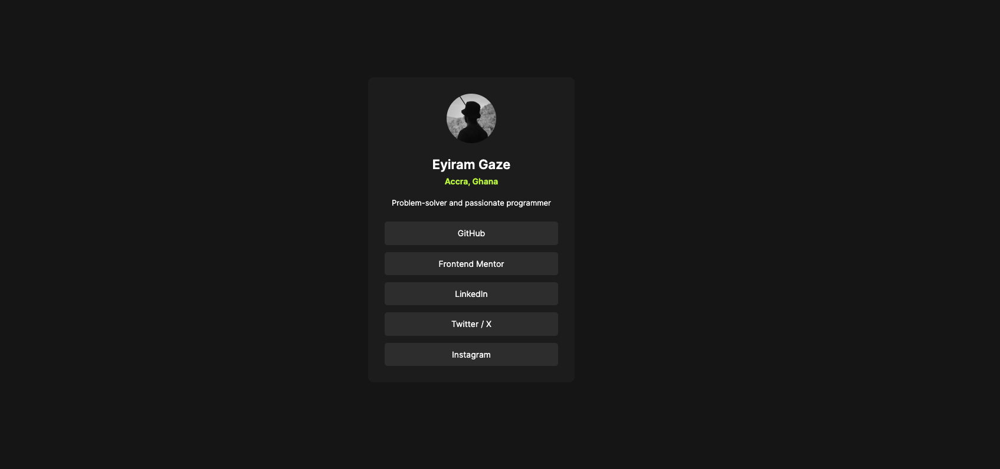

# Social links Profile

This is a solution to the [Social links profile challenge on Frontend Mentor](https://www.frontendmentor.io/challenges/social-links-profile-UG32l9m6dQ). Frontend Mentor challenges help you improve your coding skills by building realistic projects. 

## Table of contents

- [Overview](#overview)
  - [The challenge](#the-challenge)
  - [Screenshot](#screenshot)
  - [Links](#links)
- [My process](#my-process)
  - [Built with](#built-with)
  - [What I learned](#what-i-learned)
  - [Continued development](#continued-development)


## Overview

### The challenge

Users should be able to:

- See hover and focus states for all interactive elements on the page

### Screenshot



### Links

- Solution URL: [Github Repo Page](https://github.com/egaze/social-links-profile-main)
- Live Site URL: [Github Pages](https://egaze.github.io/social-links-profile-main/)

## My process

### Built with

- HTML markup
- CSS
- VS Code
- GitHub
- GitHub Pages

### What I learned

```css
:root {
    --clr-primary-Green: #c5f82a;
    
    --clr-neutral-white: #ffffff;
    --clr-neutral-grey: hsl(0, 0%, 20%);
    --clr-neutral-dark-grey: hsl(0, 0%, 12%);
    --clr-neutral-off-black: hsl(0, 0%, 8%);
```
I learnt how to set CSS variables  with custom components using the component properties that were given in the .README file

```html
<main class="wrapper">
    <div class="profile-container">
      
      <h1 class="user-name">Eyiram Gaze</h1>
      <p class="user-location">Accra, Ghana</p>
      <p class="user-description">Problem-solver and passionate programmer</p>

      <ul class="social-links">
        <li><a href="https://github.com/egaze" class="list-item">GitHub</a></li>
        <li><a href="https://www.frontendmentor.io/profile/egaze" class="list-item">Frontend Mentor</a></li>
        <li><a href="https://www.linkedin.com/in/eyiram-gaze" class="list-item">LinkedIn</a></li>
        <li><a href="https://x.com/eyiram_g" class="list-item">Twitter / X</a></li>
        <li><a href="http://instagram.com/_gaze_e/" class="list-item">Instagram</a></li>
      </ul>
    </div>
  </main>
```
I also familiarized myself with structure with HTML files and containers with regards to linking them with the CSS file

### Continued development

I want to continue to create more projects and become more conversant with building in frontend using HTML and CSS. I'm also looking to start integrating frameworks like React.JS, as it significantly streamlines the development process and reflect the modern standards of web development, with more functionality.

**Note: Delete this note and replace the list above with resources that helped you during the challenge. These could come in handy for anyone viewing your solution or for yourself when you look back on this project in the future.**

## Author

- GitHub - [egaze](https://www.your-site.com)
- Frontend Mentor - [@egaze](https://www.frontendmentor.io/profile/egaze)
- Twitter/X - [@eyiram_g](https://www.twitter.com/eyiram_g)


**Thank You for reading to the end!**